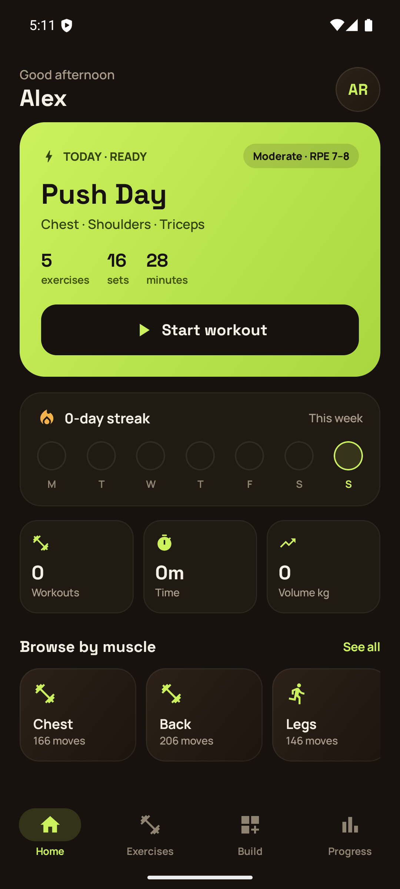
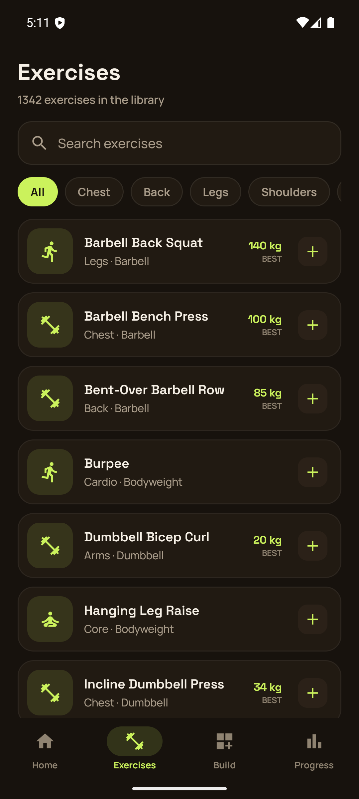
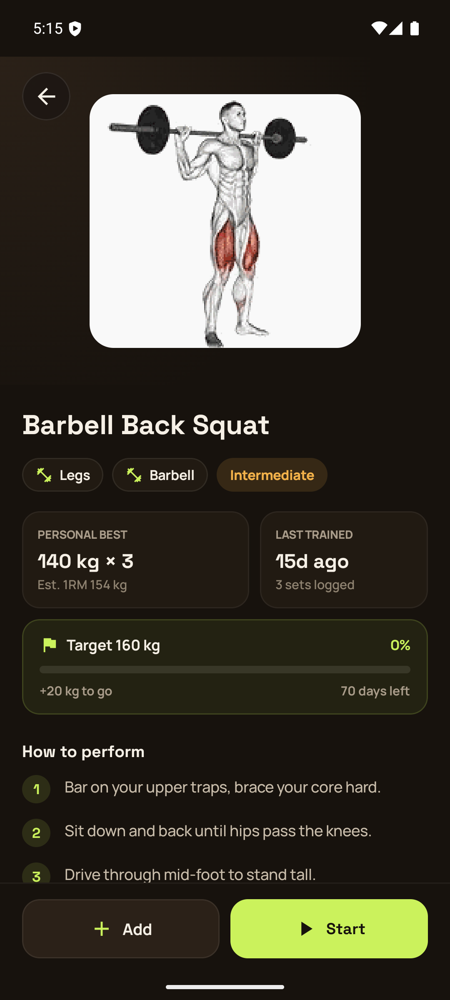
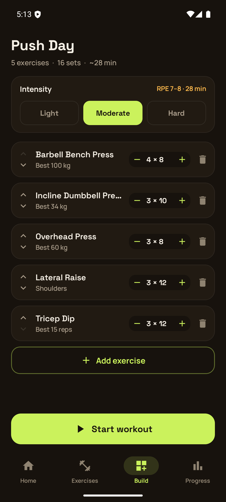
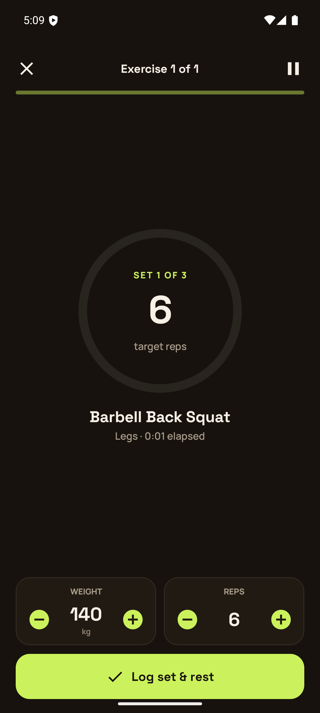
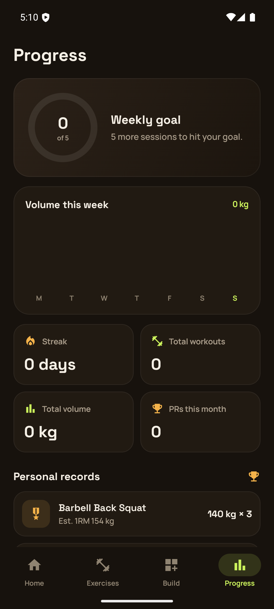
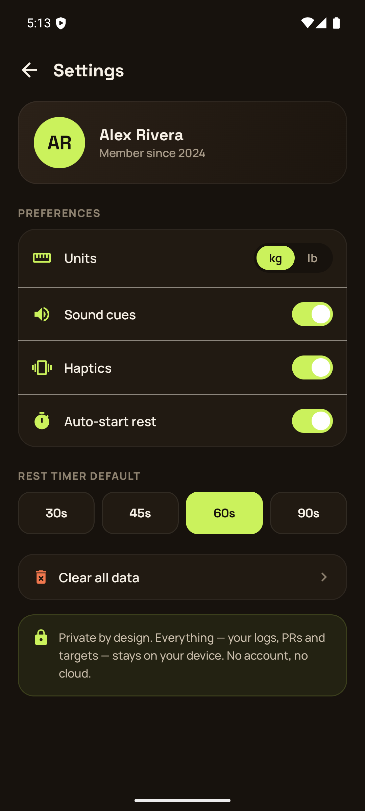

# GetFit — 100% Offline Android Workout Tracker

**A fast, private, no-account fitness app for Android.** Log sets, chase PRs, and build streaks —
everything stays on your phone. Built natively with **Kotlin + Jetpack Compose**, ported
feature-for-feature from a hand-built HTML prototype.

[](https://github.com/warpirate/GetFitPro/releases/latest)
[-3DDC84)](app/build.gradle.kts)
[](https://kotlinlang.org)
[](LICENSE)
[](https://github.com/warpirate/GetFitPro/actions/workflows/ci.yml)

## Download

Grab the latest signed APK from **[Releases](https://github.com/warpirate/GetFitPro/releases/latest)**
and sideload it — no Play Store, no account, no server. On your phone: allow "install from
unknown sources" for your browser/file manager, open the downloaded APK, and install.

## Why GetFit

- 🔒 **Private by design** — no login, no analytics, no cloud sync. Your workout history never
  leaves your device (Room + DataStore only). `allowBackup` is off, so it's not even swept into
  Android's cloud backup.
- 📴 **Works with the network off** — the app, your data, and your workouts are 100% local.
  (Exception: exercise demo GIFs stream from a CDN on first view per exercise — everything else,
  including logging, PRs, streaks, and history, works completely offline.)
- 🏋️ **1,300+ exercise library** — searchable, filterable by muscle group, each with step-by-step
  form cues and an animated demo.
- 🆓 **Free and open source** — MIT licensed, no ads, no in-app purchases.

## Screenshots

<table>
<tr>
<td></td>
<td></td>
<td></td>
</tr>
<tr>
<td></td>
<td></td>
<td></td>
</tr>
<tr>
<td></td>
</tr>
</table>

## Features

- **Splash → 3-slide onboarding** → home in the fewest taps
- **Home** — time-aware greeting, today's workout hero card, 7-day streak strip, weekly quick
  stats, browse-by-muscle shortcuts
- **Exercises** — live search + muscle filters over **1,300+ seeded exercises**, personal-best
  badges, one-tap quick-add
- **Exercise detail** — animated demo (Coil GIF with graceful fallback), PR / last-trained stats,
  target progress, how-to-perform cues
- **Workout builder** — reorder exercises, per-exercise set steppers, intensity segmented control
- **Guided session** — work/rest state machine with a live progress ring, weight/rep steppers
  prefilled from your last set, PR detection mid-set, rest controls, and a completion summary with
  PR celebration
- **Progress** — weekly goal ring, volume bar chart, personal records, goals/targets, recent
  session history
- **Settings** — kg/lb units (with real conversion, not just relabeling), sound/haptics,
  auto-rest, configurable rest timer, two-tap "clear all data"

All data is local (Room + DataStore). Empty states show real zeros — never fake demo data.

## Tech stack

Kotlin · Jetpack Compose · Material 3 · Navigation-in-Compose · Compose Animation · Room ·
DataStore · Coil (+ coil-gif) · manual DI (no Hilt). Single-activity, Compose-only. `minSdk 26`.

## Build from source

Requires JDK 17 + Android SDK (`compileSdk 35`). A `local.properties` with `sdk.dir` is
git-ignored — Android Studio generates one automatically on first open.

```bash
./gradlew installDebug             # build + install on a device/emulator
./gradlew assembleDebug            # debug APK only
./gradlew testDebugUnitTest        # JVM unit tests (domain + seeding)
./gradlew testDebugUnitTest --tests "com.getfit.domain.SessionEngineTest"
./gradlew lintDebug                # Android lint
```

## Project structure

```
app/src/main/java/com/getfit/
├─ core/{theme,anim,ui}      design tokens, springs, reusable atoms, icon map
├─ data/{db,prefs,repo}      Room, DataStore, repositories, dataset seeder
├─ domain/                   pure business logic (PR/1RM, streak, week-agg, session engine) — unit-tested
├─ di/                       AppContainer (manual DI) + ViewModelFactory
└─ ui/                       AppViewModel + per-screen composables + RootScaffold
```

## Exercise demo GIFs

The bundled dataset ships a `media_id` per exercise but not the GIFs themselves (the original
host went dark and hotlinking is blocked). `core/Constants.MEDIA_BASE` points at a pinned,
immutable community mirror served via jsdelivr; demos load `{media_id}.gif` through Coil with a
shimmer-then-fallback-icon flow, so the app still works fully offline or if a given GIF is
missing — you just lose the animation for that exercise.

## Contributing

Issues and PRs are welcome. `GetFit.dc.html` (the original HTML/JS prototype) is the source of
truth for design, copy, and business-logic behavior — see [CLAUDE.md](CLAUDE.md) for the full
porting guide and architecture notes before making changes.

## Docs

- `docs/superpowers/specs/` — design spec
- `docs/superpowers/plans/` — phased implementation plan
- `CLAUDE.md` — architecture and porting guide for contributors

## License

MIT — see [LICENSE](LICENSE).
